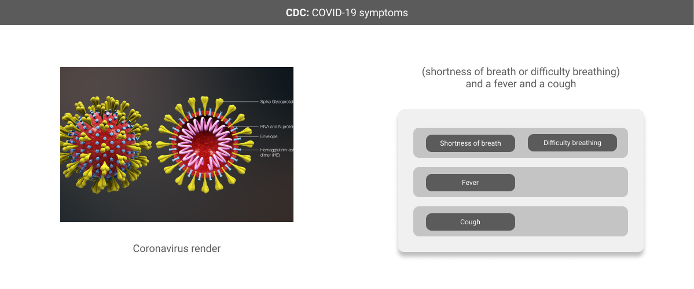

# Logicmap

## What is a logic map?

A logic map is a simple data structure always resolved to True or False. At any point in time you can ask "does the logicmap resolve true?" and get a true/false answer.

Logicmaps have three unique parts; cards, statements and bricks.

.png>)

Logicmaps enforce relationships between the different components. All Statements have AND relationships, and all Bricks have OR relationships.

.png>)

Abstract concepts are hard to grasp - so we can use a concrete example of this relationship to better understand the logicmap.

### COVID-19 testing example

We can think about symptoms to a virus as a logicmap. Recent the Coronavirus or COVID-19 has been afflicting the world and the CDC has released information about symptoms and containment.

### Defining a logicmap

We can use the description of the symptoms to build a logicmap.

We can use this map to quickly test patients. As you can see we mapped the above text from the CDC to the Card, Statement, Brick format we saw above.

### Using the logicmap

Now we can meet some patients and test their symptoms against the logicmap

Alice seems like she's sick.. but doesn't have the expected breathing issues associated with COVID-19

Bob on the other hand is not to lucky. He expresses enough of the symptoms for the logicmap to return true. Bob may have Coronavirus 😷

### Summary

So there it is, a logicmap is really just a simple structure that allows a developer to build logical maps of real world systems.

In the example we looked at how having specific symptoms can be defined as logicmap's and how we can use this map as a way to machine check patients.

While this is a toy example, logicmap's can handle much more complex and practical relationships in the real-world.

In the educational space, this framework can model the relationships between pre-reqs and classes, or the relationship between classes and degrees.

In the human resource space we can apply this same data model to the relationship between skills and an open position.

## Differences queries

Queries and logicmaps both check things against a set of criteria but are fundamentally different.

They are essentially exact opposites of one another

-   queries allow a user to specify criterion and return items that meet all of the criteria.
-   logicmaps allow a user to specify criterion and then check a single item against the criterion

The difference in the description is subtle but critical. Sometimes you may want things that meet a criteria, other times you want to see how well a thing meets a criteria.

### Query vs Logicmap for Degree Auditing

Take the example of using queries and logicmaps to check if a student has completed all the requirements needed for a college degree.

We could write a query that checks a students history for each requirement - if the query returns null, then they arent ready to graduate. If they come up then we know that they met all the requirements.

### Query Limitations

The issue here is we have no insight to why a student does or does not meet their degree! Are they one class away? Which requirement is not met?

All of that information is lost in a query since we only return things if they meet all of our criteria.

### Use Cases

How to build a [Degree Audit Engine](https://www.notion.so/drbh/Building-Degree-Audit-Engine-3e142d28b23b44148d5d647dc0c32d50)
